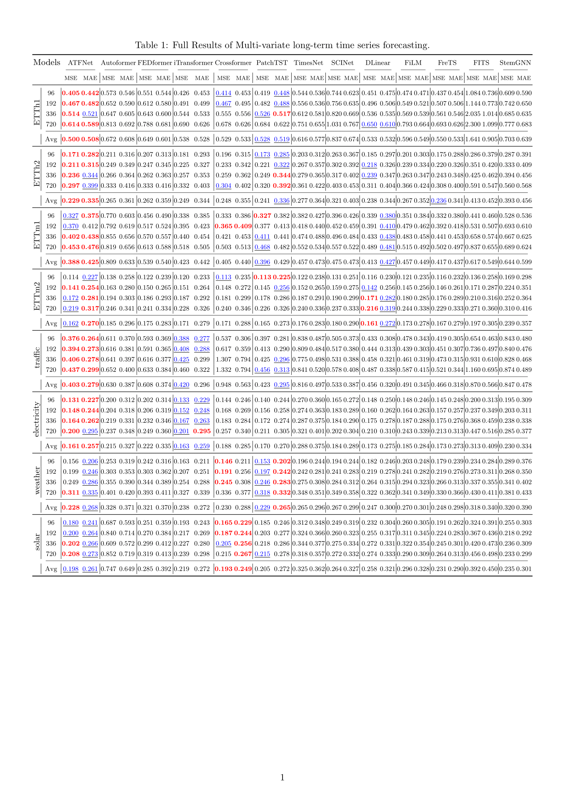

# ATFNet
Official implement of ATFNet: Adaptive Time-Frequency Ensembled Network for Long-term Time Series Forecasting

## Model Architecture

## Main Results

The best results are in bold and the second best results are underlined.  

