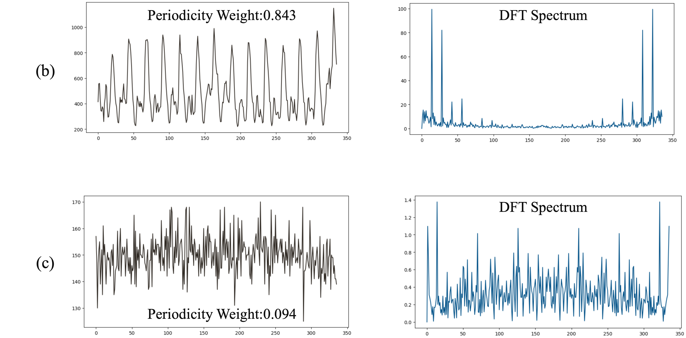
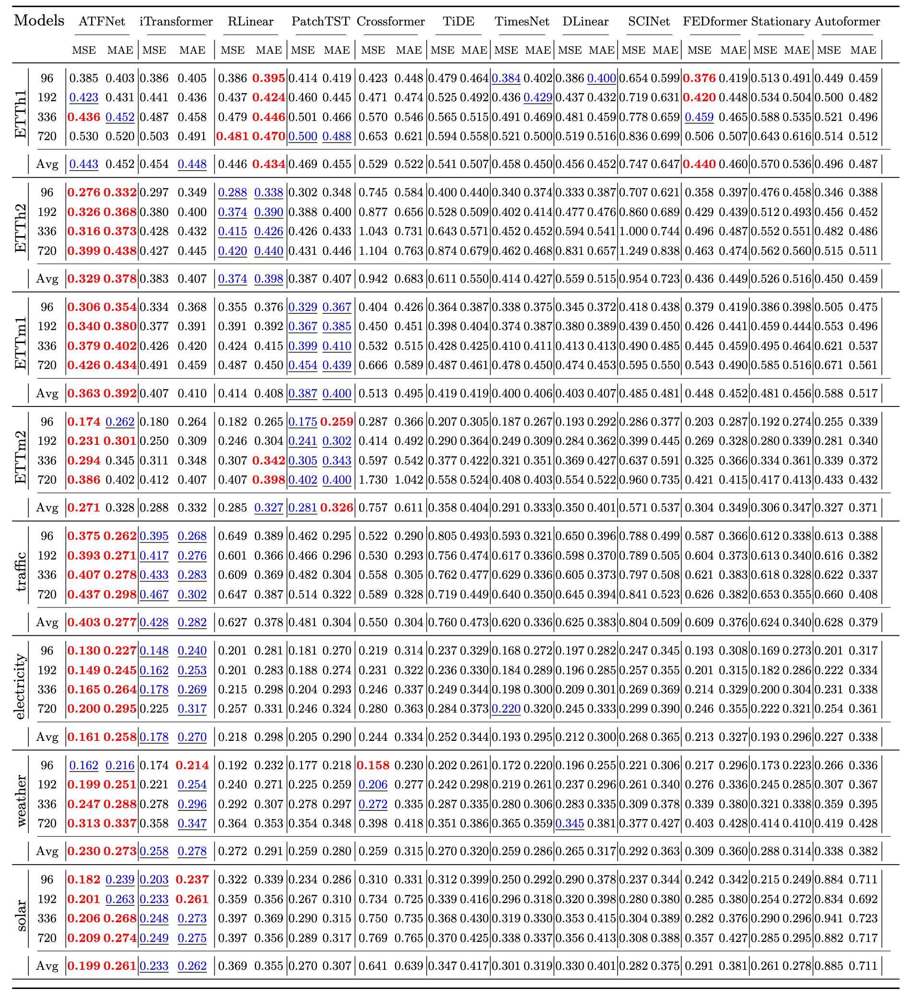

# ATFNet
Official implement of ATFNet: Adaptive Time-Frequency Ensembled Network for Long-term Time Series Forecasting

<!-- ## Supplementary material
### 1. Visualization of cases in Figure 1 (b) and (c)

### 2. Full results for multi-variate forecasting under TimesNet setting. 
All baseline results are directly referenced from iTransformer[1]

[1] Liu Y, Hu T, Zhang H, et al. itransformer: Inverted transformers are effective for time series forecasting[C]//The Thirteenth International Conference on Learning Representations. 2024.
 -->

## Model Architecture

## Main Results
- Multi-variate long-term time series forecasting results on 8 datasets. The best results are in bold and the second best results are underlined.  

- Forecasting Results Visualization

(Visualization of the input-192-predict-192 forecasting results on ETTm2 dataset.)

## Acknowledgement
We acknowledge with great appreciation the significant contributions of the following GitHub repositories, which have provided invaluable code bases and datasets for our research.

- https://github.com/thuml/Time-Series-Library
- https://github.com/cure-lab/SCINet.
- https://github.com/aikunyi/FreTS.
- https://github.com/VEWOXIC/FITS
- https://github.com/microsoft/StemGNN/
- https://github.com/thuml/Autoformer.
- https://github.com/MAZiqing/FEDformer

