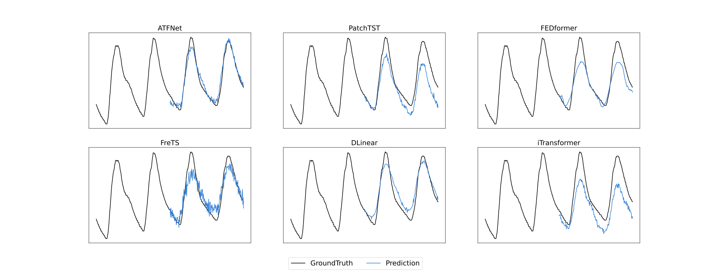

# ATFNet
Official implement of ATFNet: Adaptive Time-Frequency Ensembled Network for Long-term Time Series Forecasting

## Model Architecture

## Main Results
- Multi-variate long-term time series forecasting results on 8 datasets. The best results are in bold and the second best results are underlined.  

- Forecasting Results Visualization

Visualization of the input-192-predict-192 forecasting results on ETTm2 dataset.

